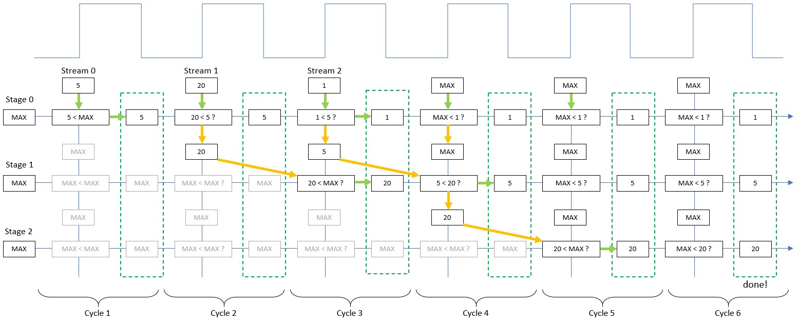

# Sorting in linear time

A sort has to be n.log(n), right? Well, not if you have a pipelined architecture!

**Note:** This is a toy example demonstrating Silice pipelines, as well as pre-processor for code generation.

## What this does

This algorithm is designed to sort a stream of values as they come in. The sort is pipelined such that
if N values are received, they are sorted after 2.N cycles (linear time!). Of course there is no free lunch, and this
comes at the cost of a pipeline of depth N. So beyond being a fun -- and hopefully interesting -- example, 
this will only be useful in practice for relatively small values of N. But such cases do occur in practice, and this
algorithm may come in handy.

## How to test

Run `make verilator` or `make icarus` (the latter will open gtkwave with the simulated waves).

You will see a list of sorted entries, such as:

```
[          0] =   1
[          1] =   4
[          2] =  45
[          3] =  50
[          4] =  78
[          5] =  89
[          6] = 122
[          7] = 131
[          8] = 144
[          9] = 149
[         10] = 181
[         11] = 190
[         12] = 206
[         13] = 209
[         14] = 219
[         15] = 228
```

Now, let's have a look at [main.ice](https://github.com/sylefeb/Silice/blob/wip/projects/pipeline_sort/main.ice).

The algorithm is built around a main while loop:
```c
  uint8 i = 0;
  while (i<$2*N$) {
     ...
  }
```
The pipeline is within the loop, and the iterates 2.N times to ensure the pipeline is fully flushed at the end.
The syntax `$2*N$` is using the Lua preprocessor, indeed N is a preprocessor variable defined before with this line:
```c
$$N=16
```
Using `$$` at the start of a line indicates that the entire line is preprocessor code, while using `$...$` within a line of 
code inserts the preprocessor result within the current code line. So for instance `$2*N$` becomes `32` when N=16.


## Principle

This is an example of a pipelined sort algorithm.

It runs in O(n) (2.n cycles for n entries).


